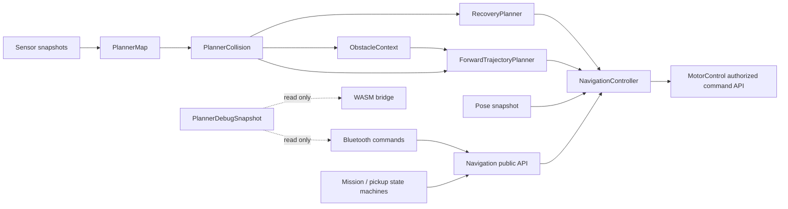

# Code Cleanup Record and Local Planner Split Plan

Generated 2026-07-29 as a read-only source audit. No production, simulator, UI,
mission, or test source was changed during this audit.

## Bottom line

The active firmware is under control, but it is at the point where one more
feature family would make ownership hard to follow. The problem is not a large
amount of unreachable compiled code. The compiler emitted no unused-function
warnings, and the source reference scan found a live call for every static
helper definition.
The main problems are:

1. a small, high-confidence set of write-only state and unused constants;
2. compatibility layers that are still referenced but no longer drive the
   robot;
3. shared globals exposed through `Robot.h`;
4. two planner implementations in the simulator: the active C++/WASM planner
   and the older JavaScript reference planner;
5. `LocalPlanner.cpp` owning map storage, collision geometry, obstacle context,
   forward rollout, recovery, goal lifecycle, scheduling, and telemetry in one
   5,040-line translation unit.

The correct cleanup is evolutionary. Preserve the current driving behaviour,
put a narrow navigation API in front of it, extract cohesive internals behind
that API, and only then build pickup and mission states against the API.

## Implementation checkpoint: 2026-07-29

The first cleanup checkpoint has been applied:

- Patch 1 confirmed-dead-code removals are complete for firmware constants,
  write-only globals, unused planner fields, disabled turn-ladder calibration
  baggage, unused WASM exports, the unused competition scoring helper, and
  the listed Python unused names.
- Patch 2 has begun: the misleading non-neutral `setMotionCommand()` API was
  replaced by stop-only `requestMotionStop()`, and mission route/weight-search
  owner checks now use `NavigationStatus` instead of reading `navigationGoal`
  directly.
- Patch 3 has begun: the WASM bridge now reads planner internals through
  `PlannerDebugSnapshot`, `plannerDebugMapState()`, and
  `plannerDebugSeedMapOccupied()` instead of directly naming obstacle context,
  emergency recovery state, local-map cells, or planner epochs. The bridge
  still includes `LocalPlanner.cpp`; removing that include waits for the
  `PlannerContext` and file-split patches.

Latest software gate after this checkpoint:

- warning-enabled Teensy 4.0 firmware compile: PASS;
- full validation compile and WASM build: PASS;
- legacy JavaScript simulator tests: PASS;
- targeted Python source-shape/live-map tests: PASS;
- full Python compileall: PASS;
- remaining full-validation failures are the pre-existing emergency-scan
  baseline issues: two firmware/WASM emergency-recovery tests and the Python
  default-contract assertion for `PLANNER_EMERGENCY_SCAN_ENABLED`.

Next strict-plan step: do not start feature work. Create `PlannerContext` and
move mutable planner state into it before extracting map, collision, obstacle,
forward trajectory, progress, and recovery modules.

## Audit scope and evidence

Primary scope:

- all active `RobotCode` `.ino`, `.cpp`, and `.h` modules;
- the WASM bridge and browser simulator that execute or duplicate planner
  behaviour;
- `SerialCommandUI` and the TOF classifier experiment at a lighter
  unused-symbol and role-separation level.

Historical `RobotCode - Copy*` directories, saved logs, and old standalone
sketches were treated as archives, not as active firmware.

Source identity:

- active firmware source SHA-256:
  `767b076dec2796cedfdca433309fb3d20032b7ae96876ecc44421d1729e2759a`;
- 12,963 physical lines across active firmware `.ino`, `.cpp`, and `.h` files;
- 11,257 physical lines in active `.ino` and `.cpp` implementation files;
- `LocalPlanner.cpp`: 5,040 lines;
- `Bluetooth.cpp`: 2,287 lines;
- `StateMachine.cpp`: 794 lines.

Checks performed:

- symbol-reference scan over active firmware;
- cross-check against the WASM bridge, simulator adapter, simulator tests, and
  desktop tools;
- enum, struct-field, global, constant, exported-function, Python import, and
  Python callable scans;
- `arduino-cli compile --warnings all --fqbn teensy:avr:teensy40 RobotCode`.

The warning-enabled Teensy 4.0 compile passed:

- FLASH code: 154,744 bytes;
- FLASH data: 29,880 bytes;
- RAM1 variables: 200,832 bytes;
- RAM2 variables: 12,416 bytes.

The compiler emitted no unused-function warnings. This does not prove that all
state is useful: several fields are assigned but never read, and compatibility
entry points are intentionally reachable.

## Classification rules

- **Remove now**: no live firmware, simulator, test, telemetry, or tooling
  consumer was found.
- **Remove after contract check**: no behaviour producer or consumer was
  found, but deleting it changes an enum, command, telemetry, or host interface.
- **Optional diagnostic**: not part of autonomous driving, but still useful
  during calibration or fault investigation.
- **Keep**: active behaviour, safety, evidence, or hardware ownership.
- **Restructure**: live code whose responsibility is valid but whose current
  location or coupling obstructs future work.

## Confirmed unused code

These are the highest-confidence deletion candidates.

### Firmware constants

`RobotConfig.h` defines the following names, and the active firmware contains
no reference other than the definition:

- `DEBUG_DRIVE`
- `DEBUG_TURN`
- `FRONT_CLEAR_SETTLE_TIMEOUT_MS`
- `FAKE_REAR_TOF_DISTANCE_MM`
- `PLANNER_ESCAPE_SPEED_LIMIT_START_M`
- `PLANNER_ESCAPE_SPEED_LIMIT_FULL_M`
- `PLANNER_ESCAPE_MIN_SPEED_TPS`
- `PLANNER_ESCAPE_FORCE_TURN_URGENCY`
- `PLANNER_ESCAPE_FORCE_TURN_MIN_RATIO`
- `PLANNER_POINT_ALIGN_BEHIND_DEG`
- `PLANNER_POINT_ALIGN_SIDE_TIE_MM`

`Bluetooth.cpp` also contains three unused constants left from the disabled
blocking turn ladder:

- `TEST_TURN_LADDER_PULSE_MS`
- `TEST_TURN_LADDER_COAST_MS`
- `TEST_TURN_LADDER_STEP_COUNT`

The disabled command stub itself is a separate compatibility decision; these
three constants are not used even by that stub.

### Firmware globals

The following globals are written but never read:

- `lastFrontTofReadMs`
- `lastLeftTofReadMs`
- `lastRightTofReadMs`
- `previousState`
- `recentBlockedTurnDirection`
- `recentBlockedTurnMs`

The first three duplicate timestamps already held in `rangeSensors`. Removing
them means deleting their declarations, definitions, and assignments in
`syncLegacyTofGlobals()`.

### Local planner types and fields

The complete `ReverseSurveyDecision` enum is unused:

- `REVERSE_SURVEY_REVERSE`
- `REVERSE_SURVEY_HOLD`
- `REVERSE_SURVEY_FORWARD`

The following planner fields are assigned but never read:

- `ObstacleContext::startedMs`
- `PlannerEpoch::bestClearance`
- `ReverseRecoveryState::endpointClearanceM`
- `ReverseRecoveryState::unexploredScore`
- `ReverseRecoveryState::previousTurn`
- `EmergencyRecoveryState::triggerReason`
- `EmergencyRecoveryState::triggerDetail`
- `ReversePlannerEpoch::bestRearClearance`
- `ReversePlannerEpoch::bestEndpointClearanceM`
- `ReversePlannerEpoch::bestRotationalClearanceM`
- `ReversePlannerEpoch::bestSweepClearanceM`
- `ReversePlannerEpoch::bestForwardQuality`
- `ReversePlannerEpoch::bestUnexploredScore`
- `ReversePlannerEpoch::bestFinalX`
- `ReversePlannerEpoch::bestFinalY`
- `ReversePlannerEpoch::bestFinalHeadingRad`

The useful recovery values are already copied directly into
`plannerTelemetry`; the fields above are not the source of those published
values.

### Simulator and WASM bridge

- `scoreCompetitionRound()` is exported but has no caller.
- `firmware_sim_stop_reason_name()` is exported by the bridge/build but no
  adapter or test calls it; consumers use `firmware_sim_stop_reason_byte()`.
- `firmware_sim_build_id()` is exported by the bridge/build but no adapter or
  test calls it; consumers use `firmware_sim_build_id_byte()`.

Removing the two bridge functions also requires removing their names from
`build-firmware-core.ps1`.

### Desktop Python tools

Confirmed unused names:

- imports `LOCAL_MAP_CELLS` and `FanReading` in
  `serial_command_ui_live_map.py`;
- `wrap_angle_deg()` in `live_map_model.py`;
- `ObjectSensorReading.has_range()` in `live_map_model.py`;
- `TelemetryFrame.map_safe_fans()` in `live_map_model.py`.

`from __future__ import annotations` was not classified as unused. It changes
annotation evaluation and should remain even though a simple name scan does not
see a normal runtime reference.

## Referenced code that could be removed after a contract decision

This code is not dead. It is reachable for compatibility, diagnostics, or the
secondary simulator planner.

### Unreachable mission and legacy navigation state labels

No production transition enters:

- `APPROACH_OBJECT`
- `COLLECT_SORT`
- `UNLOAD`
- `OBSTACLE_AVOID`
- `STUCK_RECOVERY`

The first three are placeholders. The latter two are historical state-machine
labels; obstacle avoidance and recovery now live inside the local planner.
They remain referenced by `runStateMachine()` and `robotStateName()` only to
normalise or print them.

Recommendation: remove all five before adding the real pickup state machine.
Add new states only when their owner, entry, exit, timeout, and failure
transitions exist. If external telemetry consumers rely on these strings,
retire them with an explicit schema note.

### Unproduced planner stop reasons

The active planner never produces:

- `PLANNER_STOP_RECOVERY_DIVERGENCE`
- `PLANNER_STOP_RECOVERY_DISPLACEMENT`

They survive only in the enum and name mapping, with matching unused names in
the JavaScript reference planner. Remove them after checking whether archived
log parsers assume numeric enum positions. Prefer explicit enum values if
numeric stability matters.

### Duplicate obstacle bypass mirrors

`obstacleBypassPhase` and `obstacleBypassSideSign` do not influence firmware
planning. They mirror `obstacleContext` for the WASM bridge:

- firmware assigns the values;
- `firmware_bridge.cpp` reads them;
- `firmware-adapter.js` turns them into `wallPhase` and `wallSide`.

Recommendation: replace them with one read-only `PlannerDebugSnapshot`
accessor. Derive active/side directly from the obstacle context, then remove
the duplicate enum, variables, and assignments. This is a simulator-interface
cleanup, not an immediate dead-code deletion.

### Disabled turn-ladder command

`TEST TURNLADDER` is intentionally a non-moving rejection stub. Keeping a
negative command can be useful because old operator procedures fail safely.
If those procedures have been retired, remove:

- the help line;
- the parser branch;
- `runBluetoothTestTurnLadder()`;
- its source-shape contract test;
- the README command entry.

Do not restore the old blocking implementation.

### Stationary `TEST SIDE` compatibility module

`ObstacleAvoidance.cpp` is not used by autonomous obstacle avoidance. Its only
consumer is the stationary `TEST SIDE` diagnostic in `Bluetooth.cpp`.

Options:

1. keep it and rename it `AvoidanceDiagnostics.cpp`;
2. move the diagnostic beside other Bluetooth test helpers;
3. remove `TEST SIDE`, `AvoidTurnChoice`, `AvoidSideClearance`, and the module
   if physical fan-side comparison is no longer useful.

The first option is preferred while sensor geometry is still being validated.

### Thin `Navigation.cpp` compatibility layer

`goToPoint()` only checks for an active goal and calls
`startNavigationPoint()`. `runWaypointAction()` only prints the action and a
special HOME message.

Do not simply inline this into the mission state machine. Replace this file
with the narrow public navigation façade described below. The current code is
small, but it is the right location for the black-box boundary.

### Legacy ToF aggregates

`frontDistance`, `leftDistance`, `rightDistance`, and the corresponding valid
flags are derived copies of `rangeSensors`. They are still printed by STATUS
and some host-simulator plumbing, so they are not dead.

Recommendation: retain them only as a telemetry adapter. Stop exposing them as
general firmware globals, and have telemetry derive them from a sensor
snapshot. Remove them later with a telemetry schema version change.

### Object geometry fields

`ObjectSensorGeometry::zMm` and `pitchDeg` are populated but not read by the
current 2D target projection. They are useful mechanical calibration metadata
for future pickup work, so keeping them is reasonable. If the project chooses
a strictly 2D object model, remove both fields and document height elsewhere.

### `setMotionCommand()` non-neutral branch

All live callers submit zero or `PLANNER_DEFAULT_SAFE_STOP_SPEED_MPS`, which is
zero. The public function still contains a non-neutral branch that writes an
authority-less desired command. The final motor owner rejects mismatched
authority, but the API is misleading.

Recommendation: replace it with `requestMotionStop()` or make it accept no
speed arguments. All non-neutral publication should continue through
`setAuthorizedMotionCommand()`.

## Major removable duplication: JavaScript reference planner

The browser simulator defaults to the firmware C++ planner through WASM, but it
still offers a selectable JavaScript reference engine. That reference engine
contains its own:

- speed and wall constants;
- front blocking logic;
- wall-side selection and wall phase machine;
- footprint rollout and trajectory scoring;
- point alignment, goal completion, and failure rules;
- planner stop-reason vocabulary;
- dedicated test suite.

This is the largest cleanup opportunity because it is a second behaviour
implementation, not because it is unreachable. Roughly 600 lines of
`simulator-core.js`, its old wall configuration, the engine selector/fallback,
and much of the 387-line `simulator-core.test.js` belong to this reference
planner.

Recommended disposition:

1. keep simulator physics, collision, object geometry, raycasting, noise,
   dropout, telemetry capture, UI, and fixtures;
2. make WASM the only planner engine;
3. fail visibly when the WASM artifact is unavailable instead of silently
   changing algorithms;
4. port any unique geometry/sensor tests to planner-independent physics tests
   or firmware/WASM tests;
5. remove the JavaScript planner, its selector, and its duplicated tuning
   constants.

This will make “the planner” mean one thing everywhere.

## Module-by-module disposition

| Module | Disposition | Cleanup or boundary |
| --- | --- | --- |
| `RobotCode.ino` | Keep | Setup/loop only; current ownership is good. |
| `Encoders.cpp` | Keep | Hardware ISR owner; no dead code found. |
| `Imu.cpp` | Keep | IMU connection and raw yaw owner; no dead code found. |
| `Helpers.cpp` | Keep, later split by role | Maths, reset, and operator-print helpers are live. Move printing out only when focused interfaces replace `Robot.h`. |
| `Odometry.cpp` | Keep | Pose integration owner; no dead code found. |
| `MotorControl.cpp` | Keep and protect | Sole periodic motor writer; do not split authority/safety away from the final writer. |
| `MotionSafety.h` | Keep | Pure fail-closed safety policy; no dead fields found. |
| `TurnConvention.h` | Keep | Canonical sign contract; no dead code found. |
| `TofSensors.cpp` | Keep, narrow globals | Remove three write-only legacy timestamps; later hide aggregate copies behind sensor/telemetry APIs. |
| `RearObstacleSensor.cpp` | Keep | Active cooperative rear sensor path and trusted-rear gate. |
| `RearObstaclePolicy.h` | Keep | Pure aggregation/hysteresis logic with tests. |
| `ObjectDetection.cpp` | Keep, later separate from mission | Sensor/candidate owner. It should publish observations; pickup mission logic should not be added here. |
| `StuckRecovery.cpp` | Keep, consider rename | It detects lack of progress; it does not perform recovery. `MotionProgressMonitor.cpp` would be clearer. |
| `Globals.cpp` | Restructure | Remove dead globals, then migrate subsystem state into owner-specific context structs. |
| `RobotTypes.h` | Restructure | Retire unreachable states and unproduced stop reasons after protocol checks; split mission, navigation, sensor, and telemetry types. |
| `RobotConfig.h` | Keep, prune | Remove 11 confirmed unused constants; later split hardware, safety, planner, and mission config. |
| `Robot.h` | Restructure first | It is a 359-line universal include exposing nearly all globals and functions. Replace it with focused headers. |
| `Navigation.cpp` | Replace with façade | Make it the only mission-facing navigation API. |
| `ObstacleAvoidance.cpp` | Optional diagnostic | Rename or remove with `TEST SIDE`; it is not autonomous driving code. |
| `LocalPlanner.cpp` | Split behind façade | Preserve algorithm; extract map, collision, obstacle, rollout, and recovery ownership. |
| `StateMachine.cpp` | Split after façade | Move weight search into its own mission component; remove placeholder states; future pickup states use navigation results only. |
| `Bluetooth.cpp` | Split later | Remove dead ladder constants; separate command parsing, telemetry transport, and motion-test commands without changing the protocol. |
| `HostSimRobot.h` | Restructure with planner | Keep the host platform shim, but stop making it a second version of the entire `Robot.h` interface. |
| `platformio.ini` | Decide one build path | Arduino CLI is the verified path. Remove PlatformIO config if nobody uses it, or pin and validate it as an explicit secondary build. |

## Simulator and desktop-tool disposition

| Module | Disposition | Cleanup or boundary |
| --- | --- | --- |
| `RobocupSimulator/app.js` | Keep, simplify engine selection | Keep Visual Lab UI; remove the JavaScript planner selector after WASM becomes mandatory. |
| `RobocupSimulator/index.html` and `styles.css` | Keep | UI structure and presentation; remove only the old engine control with the JavaScript planner. |
| `RobocupSimulator/firmware-adapter.js` | Keep | This is the desired single browser-to-planner adapter. Consume a debug snapshot rather than duplicate file-static fields. |
| `RobocupSimulator/firmware-wasm/firmware_bridge.cpp` | Restructure | Keep the host ABI; remove two unused exports and stop including or reading planner implementation internals. |
| `RobocupSimulator/build-firmware-core.ps1` | Keep, update with split | Compile all extracted planner sources and export only consumed ABI functions. |
| `RobocupSimulator/firmware-core.js`, `.wasm`, and build JSON | Keep as generated artifacts | Do not hand-edit. Continue stamping and checking source/build identity. |
| `RobocupSimulator/simulator-core.js` | Keep physics, remove second planner | Preserve arena, sensors, noise/dropout, collision, plant, telemetry, and fixtures. Delete the JavaScript navigation policy after test migration. |
| `RobocupSimulator/firmware-core.test.js` | Keep | This is the primary simulator evidence because it executes `RobotCode`. |
| `RobocupSimulator/simulator-core.test.js` | Split then reduce | Keep physics and sensor tests; port or delete JavaScript-planner behaviour tests with the reference planner. |
| `RobocupSimulator/dev-server.js` | Keep | Development server and WASM rebuild notification are live. |
| `RobocupSimulator/fixtures/*.json` | Keep | Retained exact regressions; do not delete because architecture changes. |
| `SerialCommandUI/serial_command_ui.py` | Keep | Main guarded operator interface. |
| `SerialCommandUI/run_navigation_regression.py` and `navigation_evidence.py` | Keep | Safety-gated evidence collection and parsing. |
| `SerialCommandUI/live_map_model.py` and live-map UI | Keep, prune | Remove three unused helpers and two imports; treat the Python map as a diagnostic view, not planner truth. |
| `SerialCommandUI/serial_command_ui_field_goto.py` | Keep isolated | Preview-only and intentionally non-operational until the field-frame contract exists. |
| `SerialCommandUI/replay_navigation_log.py` | Keep | Small useful offline entry point. |
| `SerialCommandUI/test_*.py` | Keep, revise with interfaces | Source-shape safety tests remain valuable, but update them to public contracts as globals disappear. |
| `TOFReturnSignalExperiment` | Keep separate or archive | Research prototype and classifier tests; do not merge into production pickup logic without new evidence. |

## Workspace and tool cleanup

These are not production-code deletions, but they will make the active project
easier to understand:

- remove generated `__pycache__` directories from the workspace and keep them
  ignored;
- keep saved regression logs because they are evidence, but move them under one
  clearly named archive root rather than beside executable tools;
- archive `RobotCode - Copy`, `RobotCode - Copy (2)`, `RobotCode - Copy (3)`,
  and `RobotCode.zip` outside the active repository after confirming they are
  backed up;
- mark historical standalone sketches as non-production and non-uploadable;
- keep `TOFReturnSignalExperiment` as a separate research project until its
  classifier is intentionally integrated;
- keep the preview-only field GOTO UI separate from operational command tools.

## Desired black-box navigation interface

Mission and pickup code should not read `navigationGoal`, planner epochs,
obstacle context, map cells, or `plannerTelemetry` globals directly.

A small public `Navigation.h` should expose concepts like:

```cpp
struct NavigationStatus {
  bool active;
  bool completed;
  bool failed;
  NavigationGoalOwner owner;
  PlannerStopReason stopReason;
  const char* detail;
};

void initializeNavigation();
void updateNavigation();
bool startPointGoal(float worldX, float worldY,
                    NavigationGoalOwner owner);
bool startTurnGoal(float relativeDegrees,
                   NavigationGoalOwner owner);
void cancelNavigation(PlannerStopReason reason, const char* detail);
NavigationStatus getNavigationStatus();
void clearNavigationResult();
void resetNavigationMap();
```

Diagnostics can have a separate read-only `PlannerDebugSnapshot`. Mission code
should not include that diagnostics header.

The mission contract then becomes:

1. submit a goal;
2. wait while status is active;
3. react to completed or typed failed;
4. cancel explicitly when changing mission owner.

Pickup mechanisms can have their own actuator and sensor owners without
learning anything about curvature samples, obstacle envelopes, or recovery
epochs.

## Proposed LocalPlanner split

The split should preserve static allocation and avoid heap allocation. One
`PlannerContext` should own all mutable planner state; internal modules receive
references to the part they need.

| Target module | Responsibility | Current content to move |
| --- | --- | --- |
| `Navigation.h/.cpp` | Public goal/result façade and scheduler entry | goal start/cancel/result access, initialization, top-level update calls |
| `PlannerTypes.h` | Internal-only structs and enums | map cell, obstacle context/envelope, planner epochs, recovery state, rejection/result enums |
| `PlannerContext.h/.cpp` | One statically allocated owner of mutable planner state | current file-scope planner globals and reset construction |
| `PlannerMap.h/.cpp` | Rolling confidence map and persistent arena memory | arena/local map initialization, recenter, decay, ray/endpoint/traversal evidence, snapshots |
| `PlannerCollision.h/.cpp` | Pure geometry and safety queries | world/cell queries, inflated footprint sampling, clearance, unknown fraction, turn sweep and observability geometry |
| `ObstacleContext.h/.cpp` | Obstacle envelope, side commitment, temporary local goal | route-frame obstacle scan/growth, feasible side target, retained-context lifecycle |
| `ForwardTrajectoryPlanner.h/.cpp` | Forward arc generation, rollout, rejection, and scoring | speed cap, adaptive rollout, candidate evaluation, candidate score, planner epoch slicing |
| `PlannerProgress.h/.cpp` | Route-frame progress and goal terminal rules | route frame/along/lateral helpers, arrival/overshoot/miss checks, obstacle progress and recovery budget accounting |
| `RecoveryPlanner.h/.cpp` | Reverse repositioning and emergency scan/retry | reverse rollout/score/epoch, plateau handoff, emergency phases, bounded exhaustion handling |
| `NavigationController.cpp` | Point/turn orchestration and command publication | `updatePointGoal`, `updateTurnGoal`, safe pivot command, goal finish, final revalidation and authorized publication |
| `PlannerDebug.h/.cpp` | Read-only telemetry/debug view | stop-reason names and the data currently read directly by Bluetooth/WASM |

`isTurnDirectionObservable()` and `isTurnSweepSafe()` are also used by
`MotorControl.cpp` and Bluetooth motion tests. They should live in
`PlannerCollision` or a small `MotionGeometrySafety` module, not behind a
private planner implementation.

### Dependency direction



Rules that keep this acyclic:

- map code knows nothing about goals or recovery;
- collision code is query-only and knows nothing about state transitions;
- obstacle context chooses a temporary goal but never publishes motion;
- forward and recovery planners return proposals/results but never write motor
  outputs;
- only `NavigationController` may publish planner motion;
- only `MotorControl.cpp` may periodically write servo outputs;
- mission code sees only the public navigation status, never planner internals.

## Behaviour-preserving implementation order

### Patch 1: delete confirmed dead code

- remove the confirmed unused constants, globals, enum, and write-only fields;
- remove the two unused WASM exports and Python unused names;
- do not change enum ordering or public commands in this patch.

Gate:

- warning-enabled firmware compile;
- firmware/WASM tests;
- legacy simulator tests reported separately;
- Python tests and compileall;
- source searches proving every removed name is gone.

### Patch 2: seal the public navigation API

- turn `Navigation.cpp` into the façade;
- replace direct mission access to `navigationGoal` with `NavigationStatus`;
- replace non-neutral-capable `setMotionCommand()` with a stop-only API;
- keep Bluetooth diagnostics on a separate read-only snapshot.

Gate:

- motion-authority and final-writer contracts;
- route, test GOTO, turn, hunt, STOP, ZERO, and END_MATCH lifecycle tests;
- exact completion/failure strings retained unless intentionally versioned.

### Patch 3: decouple the WASM bridge

The bridge currently includes `LocalPlanner.cpp` directly and reads its
file-static state. Before splitting files:

- add `PlannerDebugSnapshot`;
- change the bridge to use public/debug accessors;
- update `build-firmware-core.ps1` to compile multiple planner `.cpp` sources
  instead of depending on direct inclusion;
- remove duplicate bypass mirror state once the adapter reads the snapshot.

Gate:

- identical build identity checking;
- map-state, obstacle-envelope, recovery, and emergency debug tests;
- no bridge access to internal planner globals.

### Patch 4: create `PlannerContext`

- move file-scope mutable planner state into one statically allocated context;
- preserve field initial values and reset order exactly;
- pass references rather than introducing new singleton globals.

Gate:

- compile and complete firmware/WASM suite;
- compare deterministic telemetry transitions for the retained scenario set.

### Patches 5-9: extract one cohesive subsystem at a time

Extract in this dependency order:

1. map;
2. collision geometry;
3. obstacle context;
4. forward trajectory planning and progress rules;
5. recovery;
6. final controller/orchestration cleanup.

Each extraction must be a mechanical move first. Do not tune constants, rename
telemetry reasons, change candidate ordering, or alter reset timing in the same
patch.

Gate each extraction with:

- Teensy compile and memory report;
- firmware/WASM tests;
- the exact retained custom and `heading-back` scenario matrix under clean and
  website-default sensing;
- zero collision regressions;
- unchanged typed terminal results;
- planner slice/yield limits;
- separate reporting of simulator-only evidence.

### Patch 10: remove the JavaScript planner

- port unique tests;
- remove the engine selector and silent fallback;
- keep simulator physics and firmware/WASM control;
- delete duplicated planner constants and wall state.

Gate:

- browser Visual Lab loads the current WASM build;
- headless firmware suite passes;
- sensor/noise/dropout, collision, CSV, import/export, and UI tests remain.

### Patch 11: simplify mission ownership

After navigation is sealed:

- remove placeholder and historical mission states;
- move weight search out of `StateMachine.cpp`;
- introduce explicit mission, pickup, payload, return, dock, and unload states
  only as they are implemented;
- give every state one owner, timeout, success transition, and typed failure
  transition;
- keep pickup actuator output ownership separate from motor output ownership.

## Acceptance criteria for the cleanup

The refactor is complete when:

- mission code includes only the navigation public header;
- `navigationGoal`, planner epochs, obstacle context, map storage, and recovery
  state are not public globals;
- the WASM bridge does not include implementation `.cpp` files or read static
  planner state;
- there is one planner implementation in the simulator;
- every retained config value has at least one live consumer or an explicit
  documentation-only designation;
- placeholder states are gone;
- pickup and mission code can be added without editing planner internals;
- all existing software safety and deterministic navigation regressions pass.

No simulator or compile result is physical validation. The current physical
sensor-coverage and watchdog uncertainties remain unchanged by this cleanup.
